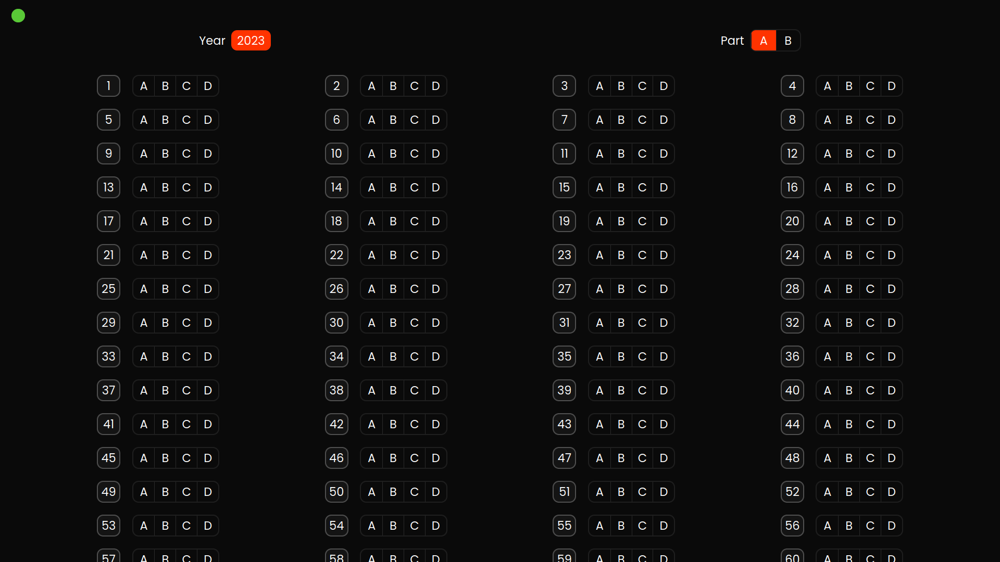
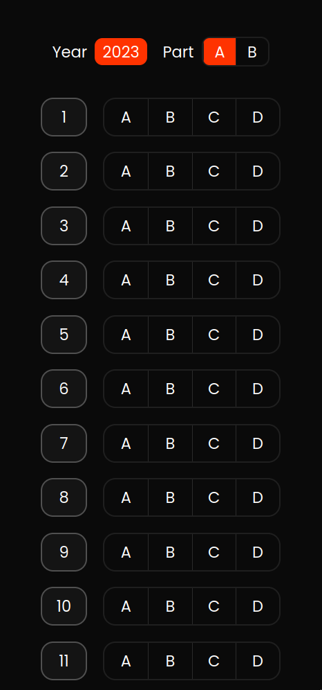
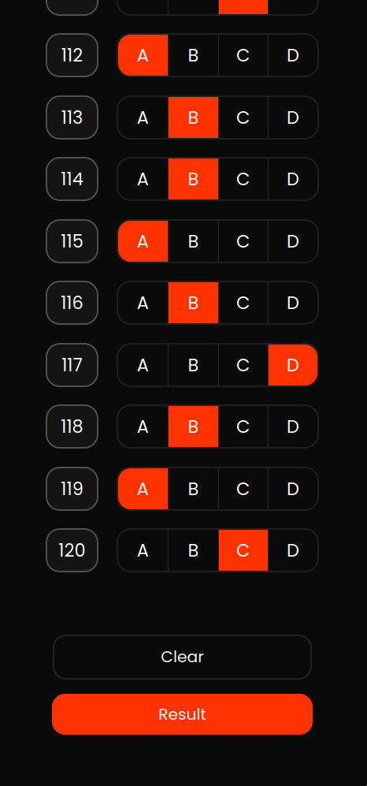
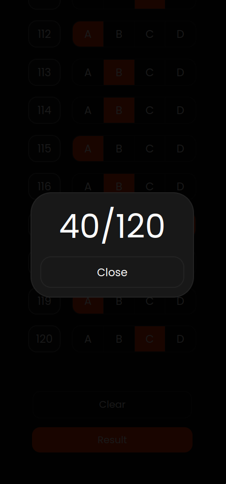

  
  # ✨ LBS MCA Mark Checker ✨
    
  **Anxiously awaiting your Marks? Check them effortlessly with this web app! ⏳**
  
  **Calculate your LBS MCA Entrance Exam (2023) marks in a flash! ⚡️**
    
  🌐 Visit the Web App: <a href="https://imsreyas.github.io/lbsMcaMarkChecker/">here</a>

  **note:** This website uses the official answer key provided by the LBS for checking the mark you have obtained. The website will only be live after the publishment of the answer key from the official side. The main use of this website is to easily check the mark you have obtained in the LBS mca entrance exam before the final publishment of result. You need to select the exact options you have selected in the LBS mca entrace exam with the help of candidates key, finally the website will provide you with the final mark according to the answer key provided by LBS.

## Key Features ✨

- Quick and easy mark calculation
- Clear and concise mark display 
- Saves you time and stress 

## Get Started in 4 Simple Steps 💯

1. Head to the website 🚀.
2. Select your options same as you done in lbs exam 😃.
3. Click the submit button 🖱️.
4. View your results instantly! 🎉.

**Don't wait any longer! ⏳ Check your marks now and start planning your future!**

## Created with ❤️ by **SREYAS**

**Additional Information :**

- A good news, The web application is mobile responsive. 😉
- Technologies used: HTML, JavaScript, CSS
- All of the calculations are handled by JS

✨✨✨
---
- **Home page**

- **Selected options**

- **Final Score**

**Mobile**
---

  
  
  

